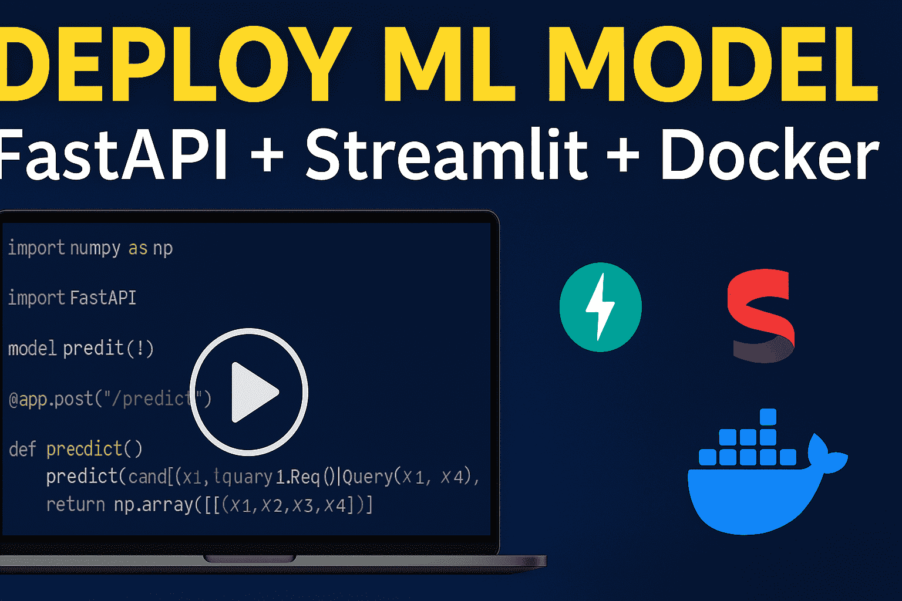

# 🚀 ML Model Deployment with FastAPI, Streamlit, and Docker

This project demonstrates how to deploy a machine learning model using **FastAPI** for backend model serving, **Streamlit** for frontend user interaction, and **Docker** for containerization.

## 📹 YouTube Video

📺 **Watch the Full Tutorial Here**  
[](https://youtu.be/YBn9zpyhMgU)
## 🧰 Tech Stack

- Python
- FastAPI
- Streamlit
- Docker
- Scikit-learn (or your preferred ML framework)

---

## Build Docker Image

To build the Docker image, run the following command in the root directory of the project:

```bash
docker build -t image_name .
```
This will create a Docker image named `image_name`.
## Run Docker Container
To run the Docker container, use the following command:
```bash
docker run -p 8000:8000 image_name
```

## Run Streamlit

To run the Streamlit app, use the following command:
```bash
streamlit run client.py
```